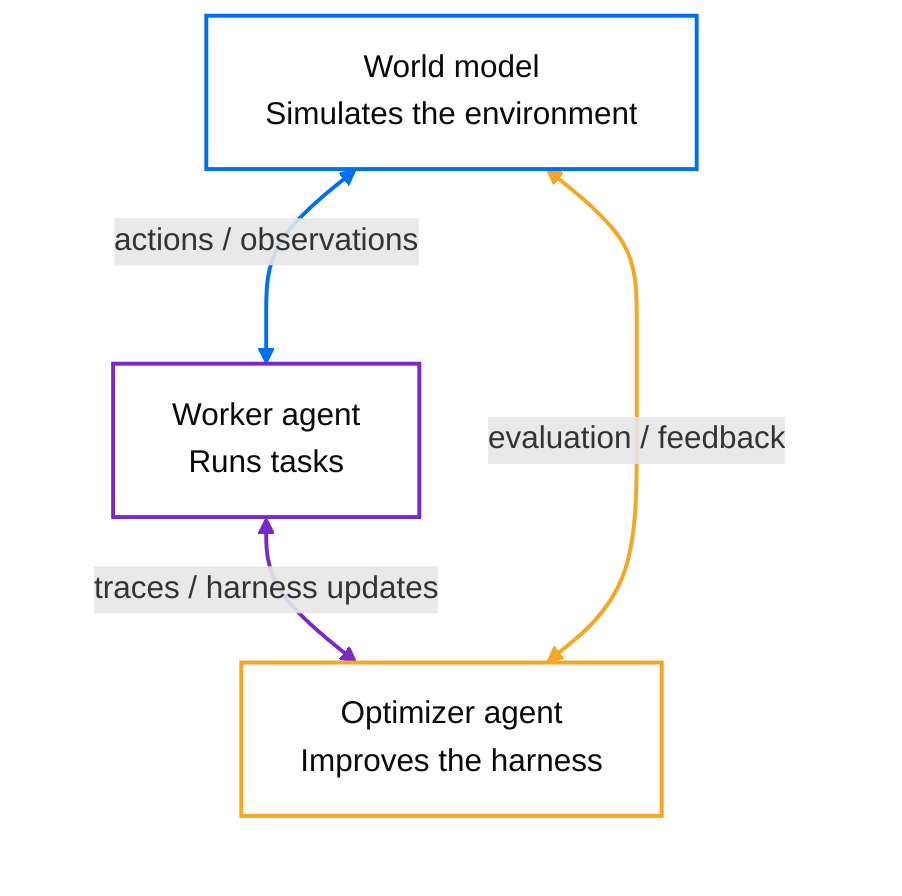

# World Model Harness

`wmh` is an open-source project for running and building continuously improving agents. It
includes a flexible agent runtime, a world model that simulates tool calls, and an optimizer that
builds task-specific harnesses for stronger performance at lower cost.



## Getting started

### Local setup

Install WMH, choose the model provider for the built-in worker agent, and start a local run:

```bash
pip install world-model-harness
wmh providers set
wmh run --task "Inspect this repository and explain it"
```

Build a named world model from collected traces:

```bash
wmh build --file traces.jsonl --name my-environment
```

Then optimize an agent harness against that model and a set of tasks:

```bash
wmh optimize my-agent my-environment --tasks tasks.jsonl
```

### Hosted platform

Create an account at [platform.experientiallabs.ai](https://platform.experientiallabs.ai), then
authenticate the CLI:

```bash
wmh login
```

Copy an agent ID from the platform and run its current champion harness:

```bash
wmh run <agent-id>
```

### E2B backend

Hosted agents already run in platform-managed E2B sandboxes. To evaluate a local optimization in
E2B, install the extra and provide an E2B key:

```bash
pip install "world-model-harness[e2b]"
export E2B_API_KEY=...
wmh optimize my-agent my-environment --tasks tasks.jsonl --backend e2b
```

## Use a world model as an API

```python
from wmh import Action, ActionKind
from wmh.config.store import WorldModelStore
from wmh.engine.loader import load_world_model

model_dir = WorldModelStore(".wmh").resolve("airline")
wm, _provider = load_world_model(model_dir)

session = wm.new_session(task="check out the cart")
obs = wm.step(session.id, Action(kind=ActionKind.TOOL_CALL, name="add_to_cart",
                                 arguments={"sku": "A1"}))
print(obs.content)
```

Or over HTTP (same code path), namespaced by model name: `GET /world_models`, then `POST /world_models/{name}/sessions` and `POST /world_models/{name}/sessions/{id}/step`.

### Pull context from the tools you already use

Traces show how your environment behaves; your team's tools hold what it knows. `wmh.connect`
fetches issues, docs, mail, messages, events, or web search results from GitHub, Google, Slack,
Notion, and Brave into one normalized `ContextItem` shape. It is a library: a host supplies a
per-service access token and calls a connector's `pull`.

```python
from wmh.connect import ConnectorAuth, PullQuery, get_connector

items = get_connector("github").pull(
    ConnectorAuth(kind="token", access_token=token),
    PullQuery(target="owner/repo", query="is:open", limit=20),
)
```

The Notion path uses the optional `connectors` extra (`world-model-harness[connectors]`, the
`mcp` SDK); everything else, and `import wmh.connect` itself, works without it. See
[`docs/reference/connect-library.md`](./docs/reference/connect-library.md).

## Run after platform login

`wmh run` is the single interactive execution command. After `wmh login`, an opaque platform id
is resolved automatically: a world-model id opens a hosted model session, while an agent id runs
that agent's champion pi harness in the platform's E2B sandbox. No local files are uploaded by
default. Add `-u PATH` (or `--upload-dir PATH`) to upload that directory as the E2B workspace,
live-sync changes, and automatically sync final regular-file changes back. Concurrent local edits
are preserved and the full E2B result is saved under `.wmh-conflicts/` for manual recovery.
Provider and E2B credentials remain platform-side, so no API keys are needed locally.

```bash
wmh login
wmh run <world-model-or-agent-id>
wmh run <agent-id> -u . --task "fix the failing tests"
wmh run --task "fix the failing tests"   # built-in pi harness, also platform-backed when logged in
```

Hosted agent sessions can also run detached: start one, return to your shell, and keep working
with it from later commands (or from the web app, where it remains an ordinary live session):

```bash
wmh run <agent-id> -d                    # start hosted, remember as the current session, return
wmh run <agent-id> -u . --detach         # same, with workspace upload + live sync
wmh run -s "Do this task"                # send a message, stream that turn until idle, exit
wmh run -a                               # attach interactively; :detach leaves it running
wmh run --end                            # end it explicitly, with the final workspace sync
wmh run --session <session-id> --send "Do this task"   # address a specific session
```

An interactive `wmh run <agent-id>` can also be promoted mid-session: type `:detach` to leave
the hosted session running as the current detached session (with `-u`, the sync checkpoint is
carried over), then continue with `-s`/`-a`/`--end` as above.

The current-session reference (and, with `-u`, a synchronization checkpoint) lives in WMH user
state under `~/.wmh/sessions/`, not in your repository. Every send/attach/end first catches up:
workspace changes the agent made while nothing was attached are applied locally, and local edits
made since the checkpoint are uploaded, before the command proceeds. In a detached-started or
attached session (`-a`), leaving never ends the run: `:detach`, Ctrl-D, and a second Ctrl-C all
leave it alive, and only `wmh run --end` or the interactive `:end` command terminates it. A
plain interactive `wmh run <agent-id>` keeps its original semantics: `:quit`, `:end`, Ctrl-D,
and a double Ctrl-C end the session, while `:detach` promotes it. Lines starting with a colon
are reserved for commands and are never sent to the agent as chat. Detached sessions still
observe the platform's idle timeout: an idle session eventually ends on its own, and the next
`wmh run --end` reconciles its final workspace (even when the local checkpoint or directory is
gone, in which case the final archive is saved as a recovery file instead of synced).

For a deployment-protected preview whose public discovery route is not available to a
non-browser client, pair its browser and backend URLs explicitly:

```bash
wmh login --url https://preview.example --api-url https://preview-api.example
```

Workspace transport skips symlinks, VCS internals, virtual environments, dependency trees, and
common caches. Uploads are capped at 50 MiB compressed and 512 MiB unpacked.

The bare built-in pi path runs locally and requires Node.js 22.19 or newer plus npm on `PATH`. WMH
installs the pinned pi npm dependencies into its user cache on the first run. Harness code and
shell commands run with your normal user permissions: file tools are restricted to `--dir`, but
bash is not OS-sandboxed. The CLI states this boundary before the local pi process starts. A
logged-out bare `wmh run` remains available with local provider environment credentials.

## Worker and optimizer agents in E2B sandboxes

Harness evals normally drive a plain in-process worker loop. With `--harness-backend e2b`, a
`pi-node` harness runs the **real vendored [pi](https://github.com/earendil-works/pi) worker**
with actual context management and actual harness code as a process inside an
[E2B](https://e2b.dev) sandbox, one sandbox per (scenario × pass), **all rollouts in parallel**.
The environment stays the world-model simulation on every backend: the sandbox only hosts the
agent process, its tool calls come back over a stdin/stdout frame channel and are answered
host-side by the world model, and the worker LLM is completed host-side too — **no provider
credentials ever enter a sandbox**.

```bash
uv sync --extra e2b                # the e2b SDK is an optional extra
export E2B_API_KEY=...             # sandboxes; the only credential involved
uv run wmh optimize my-agent my-environment --tasks tasks.jsonl --backend e2b \
  --iterations 5 --proposal-batch-size 3
uv run wmh eval tasks.jsonl --mode closed-loop --harness pi-agent --harness-backend e2b
```

Sandboxes are pooled and reused across the whole search (bootstrap paid once, lifetimes
auto-extended). Set `WMH_E2B_TEMPLATE` to a prebaked template with node ≥ 22.6 and pi's npm deps
at `/home/user/pi-run` to skip per-sandbox installs (~13 s cold episodes); `--eval-concurrency`
caps the fan-out (default: every cell at once). Worker-LLM tokens and sandbox-seconds are metered
on the results (`worker_usage`, `sandbox_usage`).

`wmh.agents` exposes the worker agent and a separately customizable optimizer agent, called the
meta agent in the Python API, over the same vendored pi source and `LiveSession` runtime.
`AgentProject` gives an agent a persistent E2B filesystem while starting a fresh session for each
turn. `ProjectDeltaProposer` uses that ordinary agent/project pair to retain every earlier proposal.
Each optimization iteration generates a
sibling batch from the frozen current champion, evaluates every sibling against that same
snapshot, and selects at most one gate-eligible winner. Proposal batch size controls search
breadth; `k` independently controls the number of evaluation passes per scenario.

## Development

Managed with [uv](https://docs.astral.sh/uv/); linting/formatting with [ruff](https://docs.astral.sh/ruff/); type checking with [ty](https://github.com/astral-sh/ty). Conventions live in [AGENTS.md](./AGENTS.md).

```bash
uv sync --extra dev      # env + dev tools
uv run ruff check .      # lint
uv run ruff format .     # format
uv run ty check          # type check
uv run pytest -q         # tests
```

## Usage telemetry

`wmh` uses anonymous usage telemetry to track the volume of usage.
Telemetry is strictly metadata. It never includes prompts, traces, actions, observations, file paths,
model names, provider credentials, or raw user content.

Telemetry is enabled by default. To opt out for a project:

```bash
uv run wmh config telemetry disable
```

This writes `.wmh/settings.toml`. You can re-enable it with `uv run wmh config telemetry enable`,
check the current setting with `uv run wmh config telemetry status`, or disable it for a process
with `DO_NOT_TRACK=1` or `WMH_TELEMETRY=0`.
