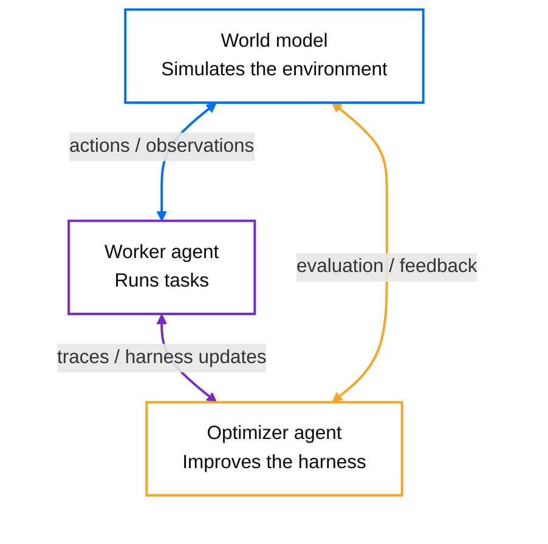

# World Model Harness

`wmh` is an open-source system for running worker agents, learning simulations of their
deployed environments from traces, and using optimizer agents to improve the harness around them.



The **world model** reproduces the environment, the **worker agent** acts inside it, and the
**optimizer agent** uses the resulting evidence to search for a better worker harness.

## Choose your starting point

Set up the repository once:

```bash
git clone https://github.com/experientiallabs/world-model-harness
cd world-model-harness
uv sync
```

### Run an open-source agent

Start the built-in [pi](https://github.com/earendil-works/pi) worker agent on a task. Logging in
lets the local harness use platform-managed model credentials; you can also stay logged out and
use local provider credentials.

```bash
uv run wmh login
uv run wmh run --task "Inspect this repository and explain it"
```

Use `--dir PATH` to choose its working directory. Use `wmh run <agent-id>` instead when you want
to run a hosted agent and its champion harness.

### Build a world model from traces

Turn recorded agent behavior into a model of the environment the agent acts against:

```bash
uv run wmh build
uv run wmh play
```

`wmh build` opens a guided flow for OpenTelemetry, chat/tool-call logs, Braintrust, Arize Phoenix,
Langfuse, LangSmith, PostHog, and Mastra traces. The resulting model can run in process, behind the
local HTTP server, or as the environment for closed-loop agent evaluation. See
[trace ingestion](./docs/reference/ingest.md) for source-specific setup.

### Optimize an agent harness

Given a world model and a task set, let an optimizer agent propose harness changes and evaluate
each candidate against the simulated environment:

```bash
uv run wmh harness create my-agent \
  --tasks tasks.jsonl \
  --model my-environment \
  --iterations 5

uv run wmh eval tasks.jsonl \
  --mode closed-loop \
  --name my-environment \
  --harness my-agent@champion
```

The search stores immutable harness versions and moves the `champion` alias only when a candidate
passes its evaluation gates. Use `--harness-backend e2b` to evaluate the real pi harness in pooled
E2B sandboxes while the world model remains the environment. See the
[closed-loop evaluation guide](./docs/reference/closed_loop.md) and
[harness update contract](./docs/reference/harness_delta.md) for the underlying workflow.

## How the loop works

1. The **worker agent** runs tasks in a real or simulated environment and produces traces,
   trajectories, and outcomes.
2. The **world model** learns a fast simulation of the deployed environment from those traces.
3. The **optimizer agent** proposes changes to the worker's prompts, tools, policies, skills, or
   runtime code, then measures the candidates in closed-loop runs against the world model.
4. The best gated candidate becomes the new worker harness, which can be validated in the real
   environment and produce the next round of evidence.

## See the world model in action

Below is a comparison running 8 SWE-bench tasks: real sandboxes on the left, a world model acting as the sandbox on the right.


## Explore the world-model tools

```bash
uv run wmh examples list          # swe-bench, tau-bench, terminal-tasks
uv run wmh eval list              # eval suites shipped with the examples
uv run wmh eval run tau-bench     # replay + score reconstruction fidelity
uv run wmh scenarios build --file traces.otel.jsonl   # traces -> judgeable eval scenarios
uv run wmh play                   # step into the environment yourself
uv run wmh serve                  # local HTTP backend on :8000
```

Example-local prebuilt models live under `examples/<task>/models/`; pass `--root examples/<task>` to `wmh list`, `wmh demo`, `wmh play`, or `wmh serve` to use one without rebuilding.

## Use a world model as an API

```python
from wmh import Action, ActionKind
from wmh.config.store import WorldModelStore
from wmh.engine.loader import load_world_model

model_dir = WorldModelStore(".wmh").resolve("airline")
wm, _provider = load_world_model(model_dir)

session = wm.new_session(task="check out the cart")
obs = wm.step(session.id, Action(kind=ActionKind.TOOL_CALL, name="add_to_cart",
                                 arguments={"sku": "A1"}))
print(obs.content)
```

Or over HTTP (same code path), namespaced by model name: `GET /world_models`, then `POST /world_models/{name}/sessions` and `POST /world_models/{name}/sessions/{id}/step`.

### Pull context from the tools you already use

Traces show how your environment behaves; your team's tools hold what it knows. `wmh.connect`
fetches issues, docs, mail, messages, events, or web search results from GitHub, Google, Slack,
Notion, and Brave into one normalized `ContextItem` shape. It is a library: a host supplies a
per-service access token and calls a connector's `pull`.

```python
from wmh.connect import ConnectorAuth, PullQuery, get_connector

items = get_connector("github").pull(
    ConnectorAuth(kind="token", access_token=token),
    PullQuery(target="owner/repo", query="is:open", limit=20),
)
```

The Notion path uses the optional `connectors` extra (`world-model-harness[connectors]`, the
`mcp` SDK); everything else, and `import wmh.connect` itself, works without it. See
[`docs/reference/connect-library.md`](./docs/reference/connect-library.md).

## Run after platform login

`wmh run` is the single interactive execution command. After `wmh login`, an opaque platform id
is resolved automatically: a world-model id opens a hosted model session, while an agent id runs
that agent's champion pi harness in the platform's E2B sandbox. No local files are uploaded by
default. Add `-u PATH` (or `--upload-dir PATH`) to upload that directory as the E2B workspace,
live-sync changes, and automatically sync final regular-file changes back. Concurrent local edits
are preserved and the full E2B result is saved under `.wmh-conflicts/` for manual recovery.
Provider and E2B credentials remain platform-side, so no API keys are needed locally.

```bash
wmh login
wmh run <world-model-or-agent-id>
wmh run <agent-id> -u . --task "fix the failing tests"
wmh run --task "fix the failing tests"   # built-in pi harness, also platform-backed when logged in
```

Hosted agent sessions can also run detached: start one, return to your shell, and keep working
with it from later commands (or from the web app, where it remains an ordinary live session):

```bash
wmh run <agent-id> -d                    # start hosted, remember as the current session, return
wmh run <agent-id> -u . --detach         # same, with workspace upload + live sync
wmh run -s "Do this task"                # send a message, stream that turn until idle, exit
wmh run -a                               # attach interactively; :detach leaves it running
wmh run --end                            # end it explicitly, with the final workspace sync
wmh run --session <session-id> --send "Do this task"   # address a specific session
```

An interactive `wmh run <agent-id>` can also be promoted mid-session: type `:detach` to leave
the hosted session running as the current detached session (with `-u`, the sync checkpoint is
carried over), then continue with `-s`/`-a`/`--end` as above.

The current-session reference (and, with `-u`, a synchronization checkpoint) lives in WMH user
state under `~/.wmh/sessions/`, not in your repository. Every send/attach/end first catches up:
workspace changes the agent made while nothing was attached are applied locally, and local edits
made since the checkpoint are uploaded, before the command proceeds. In a detached-started or
attached session (`-a`), leaving never ends the run: `:detach`, Ctrl-D, and a second Ctrl-C all
leave it alive, and only `wmh run --end` or the interactive `:end` command terminates it. A
plain interactive `wmh run <agent-id>` keeps its original semantics: `:quit`, `:end`, Ctrl-D,
and a double Ctrl-C end the session, while `:detach` promotes it. Lines starting with a colon
are reserved for commands and are never sent to the agent as chat. Detached sessions still
observe the platform's idle timeout: an idle session eventually ends on its own, and the next
`wmh run --end` reconciles its final workspace (even when the local checkpoint or directory is
gone, in which case the final archive is saved as a recovery file instead of synced).

For a deployment-protected preview whose public discovery route is not available to a
non-browser client, pair its browser and backend URLs explicitly:

```bash
wmh login --url https://preview.example --api-url https://preview-api.example
```

Workspace transport skips symlinks, VCS internals, virtual environments, dependency trees, and
common caches. Uploads are capped at 50 MiB compressed and 512 MiB unpacked.

The bare built-in pi path runs locally and requires Node.js 22.19 or newer plus npm on `PATH`. WMH
installs the pinned pi npm dependencies into its user cache on the first run. Harness code and
shell commands run with your normal user permissions: file tools are restricted to `--dir`, but
bash is not OS-sandboxed. The CLI states this boundary before the local pi process starts. A
logged-out bare `wmh run` remains available with local provider environment credentials.

## Worker and optimizer agents in E2B sandboxes

Harness evals normally drive a plain in-process worker loop. With `--harness-backend e2b`, a
`pi-node` harness runs the **real vendored [pi](https://github.com/earendil-works/pi) worker**
with actual context management and actual harness code as a process inside an
[E2B](https://e2b.dev) sandbox, one sandbox per (scenario × pass), **all rollouts in parallel**.
The environment stays the world-model simulation on every backend: the sandbox only hosts the
agent process, its tool calls come back over a stdin/stdout frame channel and are answered
host-side by the world model, and the worker LLM is completed host-side too — **no provider
credentials ever enter a sandbox**.

```bash
uv sync --extra e2b                # the e2b SDK is an optional extra
export E2B_API_KEY=...             # sandboxes; the only credential involved
uv run wmh harness create my-agent --tasks tasks.jsonl --harness-backend e2b \
  --iterations 5 --proposal-batch-size 3
uv run wmh eval tasks.jsonl --mode closed-loop --harness pi-agent --harness-backend e2b
```

Sandboxes are pooled and reused across the whole search (bootstrap paid once, lifetimes
auto-extended). Set `WMH_E2B_TEMPLATE` to a prebaked template with node ≥ 22.6 and pi's npm deps
at `/home/user/pi-run` to skip per-sandbox installs (~13 s cold episodes); `--eval-concurrency`
caps the fan-out (default: every cell at once). Worker-LLM tokens and sandbox-seconds are metered
on the results (`worker_usage`, `sandbox_usage`).

`wmh.agents` exposes the worker agent and a separately customizable optimizer agent, called the
meta agent in the Python API, over the same vendored pi source and `LiveSession` runtime.
`AgentProject` gives an agent a persistent E2B filesystem while starting a fresh session for each
turn. `ProjectDeltaProposer` uses that ordinary agent/project pair to retain every earlier proposal.
Each optimization iteration generates a
sibling batch from the frozen current champion, evaluates every sibling against that same
snapshot, and selects at most one gate-eligible winner. Proposal batch size controls search
breadth; `k` independently controls the number of evaluation passes per scenario.

## Agentic mode: knowledge base, reasoning, web grounding

Beyond retrieval, a world model can act like an *agent* about its own environment (all opt-in):

- **Knowledge base** — `wmh build --knowledge` extracts the environment's canonical facts
  (business rules, state-dependent gates, entities, tool schemas) from the train traces into
  `models/<name>/knowledge/*.md`. It's plain markdown: edit it in any editor (`wmh knowledge`
  prints the path), read/write it over HTTP (`GET/PUT /world_models/{name}/knowledge`), and the
  env keeps it in every prompt and appends its own cross-session notes to `learned.md`.
- **Reasoning** — `--reasoning` switches the output contract to deliberate-then-answer: the env
  checks the knowledge base's gates (auth, availability, preconditions) and the session history
  before deciding success vs. error.
- **Web grounding** — `--grounder brave` (env var `BRAVE_SEARCH_API_KEY`, free tier) lets the env
  issue a bounded web search when an action references a real-world entity outside its traces
  and knowledge — instead of hallucinating it; `--grounder fetch` (keyless) additionally
  live-fetches the action's own read-only `curl` GET URLs. Results are cached into the knowledge
  base; the default is `none`, so tests and evals never touch the network.
- **Verify pass** — `--verify` adds a second self-check completion per step: the env re-examines
  its draft against the gates, history, and exact computations before answering (~2× serve cost;
  measured to pay off exactly where content prediction is hardest).

## Fidelity: one knob at build, one switch at run

Build effort is a **tier**, not an iteration count:

```bash
wmh build --fidelity low     # RAG only — index the traces, ship the base prompt (near-free)
wmh build --fidelity medium  # + a light prompt-optimization (GEPA) pass        (default)
wmh build --fidelity high    # + full GEPA + a cheap auto-config search
wmh build --fidelity max     # deep GEPA + the full config ladder, to be certain
```

`high`/`max` additionally search the agentic configs (reason / +knowledge / +verify / +fetch)
on the build's held-out split — candidates pruned by a zero-token corpus signature, ties going
to the cheaper config — and record the winner in the artifact's `auto_fidelity.json`.

At run time you either just run it (pure RAG, always), or ask for everything:

```bash
wmh serve --max-fidelity     # the build-measured winning config (or all extras if unmeasured)
wmh play  --max-fidelity
```

Measure any configuration explicitly with `wmh eval run <suite> --knowledge --reasoning` (the
eval seeds its knowledge from the train split only — never from held-out traces).
## Providers

One interface, four backends, verified on startup. Credentials are read from the environment:

| Provider | Model | Env vars |
|---|---|---|
| Anthropic | Claude Opus | `ANTHROPIC_API_KEY` |
| AWS Bedrock | Claude Opus | `AWS_REGION`, `AWS_ACCESS_KEY_ID`, `AWS_SECRET_ACCESS_KEY` |
| Azure OpenAI | GPT | `AZURE_OPENAI_API_KEY`, `AZURE_OPENAI_ENDPOINT` |
| OpenAI | GPT | `OPENAI_API_KEY` |

## The monorepo

This repository is a [uv workspace](https://docs.astral.sh/uv/concepts/projects/workspaces/):
`wmh` is the flagship package at the root (the quickstart above), and sibling packages live under
`packages/`, each installable on its own:

| Package | What it does | Get it |
|---|---|---|
| **wmh** (root) | Agent traces → a faithful world model of your environment | the quickstart above |
| [`packages/llm-waterfall/`](./packages/llm-waterfall) | Pool LLM quota across models, providers, and AWS accounts: stateless failover that spills only on capacity errors, returning cost + the full attempt trail | `pip install "llm-waterfall @ git+https://github.com/experientiallabs/world-model-harness#subdirectory=packages/llm-waterfall"` *(PyPI release pending)* |
| [`packages/environment-capture/`](./packages/environment-capture) | Point it at any agent benchmark: integrate via a small adapter, capture every real agent-environment transition as OTel GenAI JSONL; 27k+ transitions already published on the [Hub](https://huggingface.co/experiential-labs) | `pip install environment-capture` |

One clone, one `uv sync`, one gate (`just gate`); each package is built and released independently.

## Development

Managed with [uv](https://docs.astral.sh/uv/); linting/formatting with [ruff](https://docs.astral.sh/ruff/); type checking with [ty](https://github.com/astral-sh/ty). Conventions live in [AGENTS.md](./AGENTS.md).

```bash
uv sync --extra dev      # env + dev tools
uv run ruff check .      # lint
uv run ruff format .     # format
uv run ty check          # type check
uv run pytest -q         # tests
```

## Usage telemetry

`wmh` uses anonymous usage telemetry to track the volume of usage.
Telemetry is strictly metadata. It never includes prompts, traces, actions, observations, file paths,
model names, provider credentials, or raw user content.

Telemetry is enabled by default. To opt out for a project:

```bash
uv run wmh config telemetry disable
```

This writes `.wmh/settings.toml`. You can re-enable it with `uv run wmh config telemetry enable`,
check the current setting with `uv run wmh config telemetry status`, or disable it for a process
with `DO_NOT_TRACK=1` or `WMH_TELEMETRY=0`.
