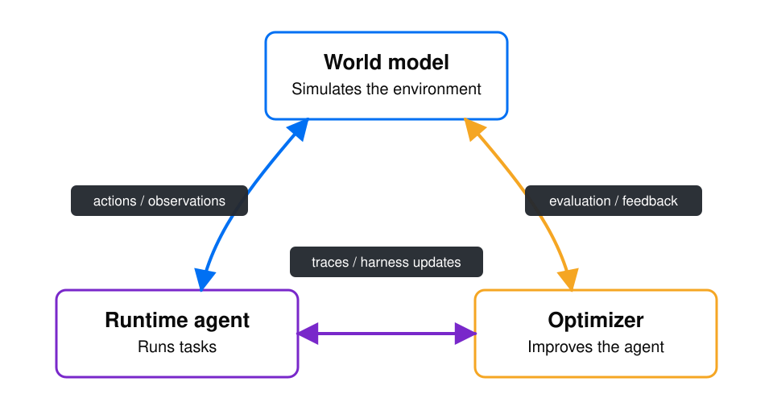

# World Model Optimizer

`wmo` turns agent traces you already collect into continuous improvement. Start with a model
endpoint at frontier quality with 40%+ lower cost. Keep improving it with world model simulations,
meta-harness optimization, and model distillation.



<p align="center">
  🌐 <a href="https://platform.experientiallabs.ai">Platform</a> |
  📚 <a href="https://github.com/experientiallabs/world-model-optimizer/tree/main/docs">Docs</a> |
  <a href="https://discord.gg/QwjJpEyHd"> Discord</a>
</p>

## Getting started

**1. Register your models.**

```bash
pip install world-model-optimizer
wmo providers set
```

**2. Tune a router on your traces.**

```bash
wmo build --file traces.jsonl --name my-endpoint

# Score every registered model on held-out tasks from your traces
wmo optimize route sweep my-endpoint --pool .wmo/pool.toml \
  --traces traces.otel.jsonl --out matrix.json

# Turn those measurements into a routing policy
wmo optimize route fit matrix.json --kind knn --fallback gpt-5.5 \
  --out .wmo/models/my-endpoint/policy.json
```

**3. Serve it.**

```bash
wmo serve --name my-endpoint
```

See what it bought you against the model you were using before:

```bash
wmo optimize route report matrix.json .wmo/models/my-endpoint/policy.json \
  --baseline gpt-5.5
```

Distill your own small model into the pool with [`wmo optimize model`](wmo/distill/README.md),
serve a single model with no routing via `wmo optimize route pin`, or build an optimized harness
for your agent with `wmo optimize harness`.

### Hosted platform

Create an account at [platform.experientiallabs.ai](https://platform.experientiallabs.ai), then
authenticate the CLI:

```bash
wmo login
```

Copy an agent ID from the platform and run its current champion harness:

```bash
wmo run <agent-id>
```

### E2B backend

Hosted agents already run in platform-managed E2B sandboxes. To evaluate a local optimization in
E2B, install the extra and provide an E2B key:

```bash
pip install "world-model-optimizer[e2b]"
export E2B_API_KEY=...
wmo optimize harness my-agent my-environment --tasks tasks.jsonl --backend e2b
```

## Use a world model as an API

`world-model-optimizer` includes world models that can be used to simulate your agent environment
for testing and optimization.

```python
from wmo import Action, ActionKind
from wmo.config.store import WorldModelStore
from wmo.engine.loader import load_world_model

model_dir = WorldModelStore(".wmo").resolve("airline")
wm, _provider = load_world_model(model_dir)

session = wm.new_session(task="check out the cart")
obs = wm.step(session.id, Action(kind=ActionKind.TOOL_CALL, name="add_to_cart",
                                 arguments={"sku": "A1"}))
print(obs.content)
```

Or over HTTP (same code path), namespaced by model name: `GET /world_models`, then `POST
/world_models/{name}/sessions` and `POST /world_models/{name}/sessions/{id}/step`.

## Run after platform login

After `wmo login`, the same `wmo run` command can open a hosted world model or run an agent's
current champion harness in E2B. The platform manages model and sandbox credentials, so hosted
runs do not need local API keys.

```bash
wmo login
wmo run <world-model-or-agent-id>
wmo run <agent-id> -u . --task "fix the failing tests"
```

Workspace upload is opt-in with `-u`: WMO live-syncs changes and preserves concurrent local edits.
Long-running agents can detach, continue in the platform, and be messaged or reattached later.

```bash
wmo run <agent-id> -u . --detach
wmo run --send "Now run the full test suite"
wmo run --attach
wmo run --end
```

## Runtime agents and optimizers in E2B sandboxes

WMO can run the real [pi](https://github.com/earendil-works/pi) worker inside isolated
[E2B](https://e2b.dev) sandboxes while the world model supplies the environment. Optimization and
evaluation rollouts run in parallel, and model credentials stay outside the sandbox.

```bash
wmo optimize harness my-agent my-environment --tasks tasks.jsonl --backend e2b
wmo eval tasks.jsonl --mode closed-loop --harness my-agent --harness-backend e2b
```

The optimizer can change prompts, tools, policies, skills, and runtime code. Every candidate is
measured against the same simulated tasks, and only changes that pass the evaluation gates become
the new versioned champion harness.

## Development

Managed with [uv](https://docs.astral.sh/uv/); linting/formatting with [ruff](https://docs.astral.sh/ruff/); type checking with [ty](https://github.com/astral-sh/ty). Conventions live in [AGENTS.md](./AGENTS.md).

```bash
uv sync --extra dev      # env + dev tools
uv run ruff check .      # lint
uv run ruff format .     # format
uv run ty check          # type check
uv run pytest -q         # tests
```

## Usage telemetry

`wmo` uses anonymous usage telemetry to track the volume of usage.
Telemetry is strictly metadata. It never includes prompts, traces, actions, observations, file
paths,
model names, provider credentials, or raw user content.

Telemetry is enabled by default. To opt out for a project:

```bash
uv run wmo config telemetry disable
```

This writes `.wmo/settings.toml`. You can re-enable it with `uv run wmo config telemetry enable`,
check the current setting with `uv run wmo config telemetry status`, or disable it for a process
with `DO_NOT_TRACK=1` or `WMO_TELEMETRY=0`.
