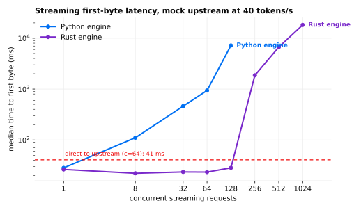
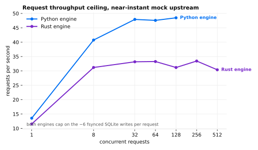
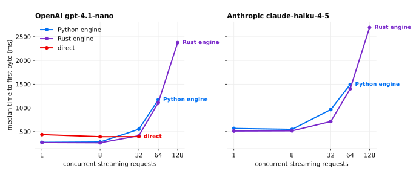

# The native gateway data plane

The local gateway serves through two data planes over one control plane. The
native engine, a Rust HTTP server compiled as the `exp_gateway_native`
extension, owns the public socket and the anonymous Chat Completions fast
path; an embedded python engine over the same authority, ledger, and routes
serves Responses, replay-keyed chat, project-backed aliases, and the usage
page. This report records the benchmark evidence behind that design and where
each engine's limits actually are. Reproduction: build the extension
(`just native`), configure direct aliases with `exp config gateway`, serve
with `exp`, and drive `POST /v1/chat/completions` at fixed concurrency
ladders; every number below is the summary of one such arm.

All measurements ran on one 16-vCPU Azure VM (Standard_D16ds_v5), with the
gateway, the mock upstream, and the load generator pinned to disjoint core
sets. Mock arms isolate gateway overhead with a loopback OpenAI-compatible
upstream; live arms use OpenAI `gpt-4.1-nano` and Anthropic
`claude-haiku-4-5`.

## Streaming concurrency is where the engines differ

With a mock upstream streaming 200 tokens at 40 tokens/s, both engines add
about 25 ms of first-byte latency at low concurrency. The python engine
departs the floor almost immediately: its per-delta work (JSON parse,
pydantic event validation, byte accounting, SSE re-encode) shares one event
loop and the GIL, saturating near 2,000 output tokens/s per process. At 64
concurrent streams its median first byte is 938 ms; at 128 it is 7.2 s,
because its executor also caps admitted requests at 64 and every stream
beyond the cap waits out a full upstream generation. The 5-second streams
themselves stretch to a 12.6 s median.

The native engine holds a flat ~25 ms median first byte through 128
concurrent streams with undistorted 5.28 s generations, and reaches roughly
21,000 relayed tokens/s per process before a different ceiling appears: at
256 streams and beyond, first-byte latency grows because admissions queue on
the shared SQLite ledger, not because token relay saturates.

## Both engines share the durability ceiling

Against a near-instant upstream, the python engine plateaus at ~48 requests/s
and the native engine at ~33, while the same load generator hits the mock
directly at 816 requests/s. The binding constraint is the request path's ~6
fsynced SQLite transactions (authenticate, authorize, accept, attempt start
with budget reservation, route context, settlement) at synchronous=FULL; the
native engine pays the same writes plus three GIL crossings, which is why its
plateau is slightly lower. Live-provider ladders reproduce the same ~30
requests/s ceiling on both engines.

At low live concurrency the native engine's added first-byte latency over
direct provider calls is ~20 ms (python: ~150 ms). From 64 concurrent
requests upward both engines queue identically on the ledger.

Sustained soaks confirm the same shape end to end: ~24,000 live streaming
requests per arm through each provider at a steady ~31 requests/s,
error rates at or below 0.02 percent, and every request accounted in
`/usage.json`; the bench ledgers closed at 189,316 requests and 27.1 million
tokens with zero accounting drift.

## What this means for horizontal scale

Per process, the native engine converts the gateway from GIL-bound (2,000
tokens/s, 64 streams) to ledger-bound (tens of thousands of relayed tokens/s,
thousands of open streams). Scaling requests/s beyond ~30-50 per process is a
durability-architecture question that no data-plane language change answers:
the options are batching terminal writes through one group-commit writer,
relaxing per-request fsync guarantees, or sharding roots across processes.
Until one of those lands, capacity planning is simple: size fleets by
requests/s per process against the ledger ceiling, not by tokens/s, and use
the native engine to keep first-byte latency flat while each process fills
its admission budget.

Proxy evaluation against a controlled mock upstream predicted every live
result within measurement noise; provider-side variance dominated only tail
percentiles. Future gateway performance work can iterate on mock arms and
reserve live spend for confirmation.
